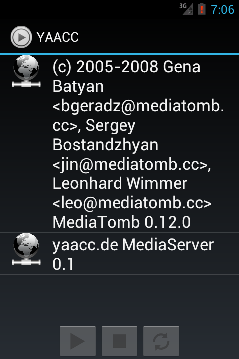
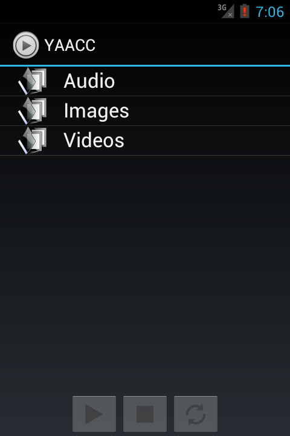
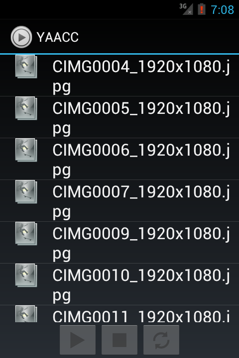
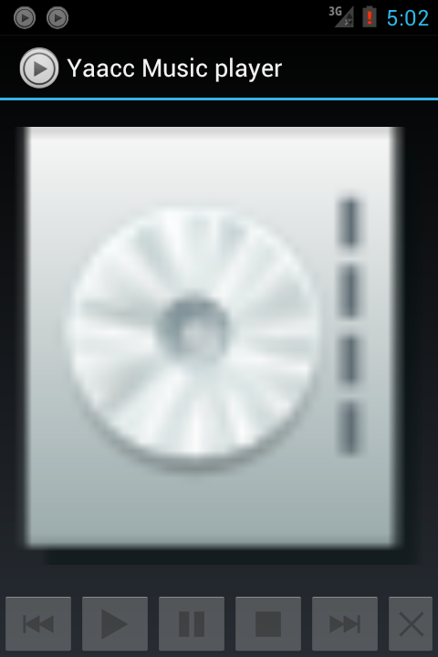
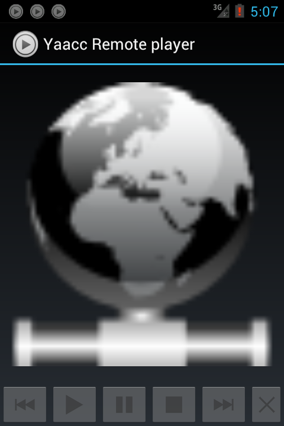
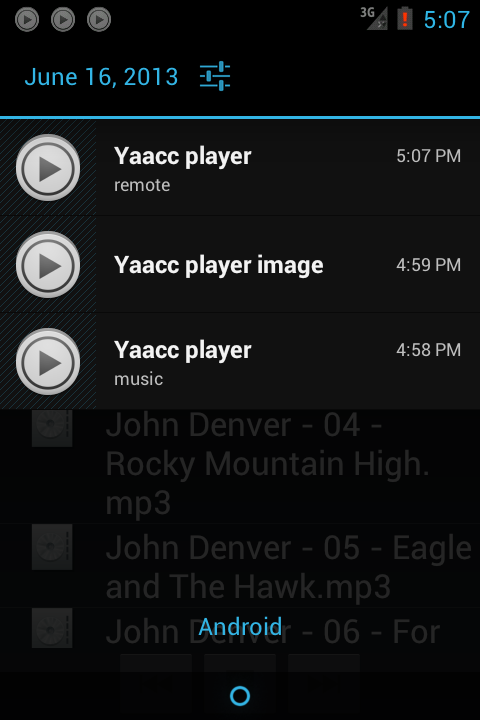
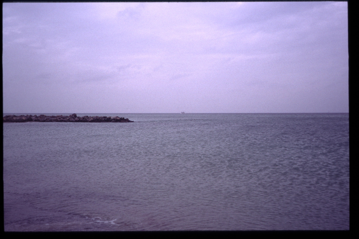
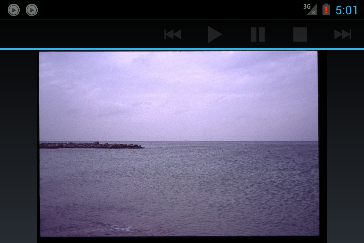
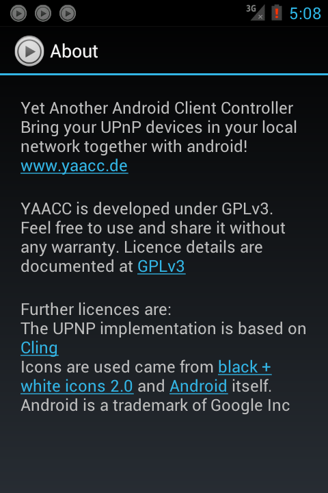

Documentation
==
[TOC]

# Installation

If you want to test yaacc on your device you have to download the latest version at: [nightlybuild](https://sourceforge.net/projects/yaacc/files/nightlybuild/) or [releases](https://sourceforge.net/projects/yaacc/files/releases/). After downloading the apk you are able to install it on your device. Please remember to enable the installation of "unknown sources" in the security section of the settings menu of your device. 

After releasing the first release of yaacc, it will be installable via markets.

# Features

The following features are supported by yaacc:

* List all UPNP servers in your network
* List all UPNP receivers in your network
* Select an UPNP server which is providing the media data
* Select an UPNP receiver device. The receiver can either a remote device or the device itself.
* If desired yaacc is able to start a UPNP server on your device in order to send the media on your device to an UPNP receiver in the network.
* Yaacc is also able to be an UPNP receiver controlled by another device in your network. It is possible to attach an amount of android devices with yaacc installed on them to your network and control all of them separately by another UPNP controller (like yaacc). 
* Yaacc is able to control an unlimited list of players at the same time. Only your device capabilities will limit this. For example you are able to stream a image show with background music on your device.
* Browse all media data provided by the sending UPNP server
* Yaacc supports all media types supported by your device. Some media type like videos for example need a special third parties app. [VLC](http://www.videolan.org/vlc/) might be a good choice. For playback music and image files yaacc provides an embedded activity.
* Yaacc is able to be a upnp media renderer in your network
* Yaacc is able to be a upnp content directory serving the content of your device to other devices in the network

All features are described in detail in the following sections...
 

# Browse

# Player

Selecting and playing  media files is the main feature of yaacc - who is wondering :-) But the player concept of yaacc is really flexible. Yaacc is able to control an  amount of players, which is only limited by your device. 
A player can be either a local player or a player for controlling a remote upnp device in your network. For example it is possible to play music and a slide show at the same time on your device. And it is possible that the music in this example is controlled by an remote device and the slide show is controlled by the local device in your hand.
There are no restrictions in combining players and devices. With yaacc you are able to control a slide show streamed on a beamer and a music stream played by your internet radio receiver at the same time.

## music player

## remote player

## player notification

# image viewer

# Upnp renderer
If enabled in the settings menu, yaacc is able to receive upnp AVTransport commands. This feature allows you to stream media of an upnp content directory  to your device.
A use case for this may be using an android HDMI stick on your TV with yaacc installed on it and then stream a media file from your content directory to the stick using a upnp controller your choice. With yaacc as upnp controller you are able to control different media renderer at the same time. With yaacc as upnp media renderer you are able to build your multimedia tv using a normal tv and a android device. 

# Upnp content directory
Yaacc is able to serve the media of your android device in the network. If enabled the server in the settings menu all media files in your mediastore are accessible by other upnp devices in your network.
For example the use case for this is streaming your photo gallery on your device to an TV without setup an wired connection.  

# About dialog

Surely yaacc has an about dialog. It is displaying all license information. Yaacc based on different open source projects for doing all the upnp network stuff or creating icons. Many thanks to these projects. Yaacc is possible because of those guys! 

Current related Project are: 

[Cling](http://4thline.org/projects/cling/)
[black + white icons 2.0a](http://www.carpicon.com/index.php?option=com_content&task=view&id=6&Itemid=26)
[Android a trademark of Google Inc.](http://developer.android.com/about/index.html)
 

